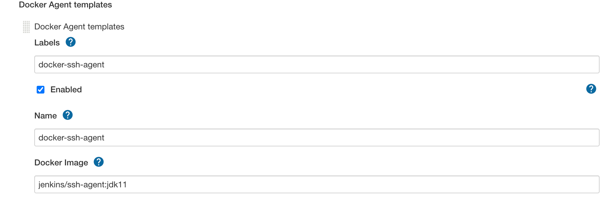
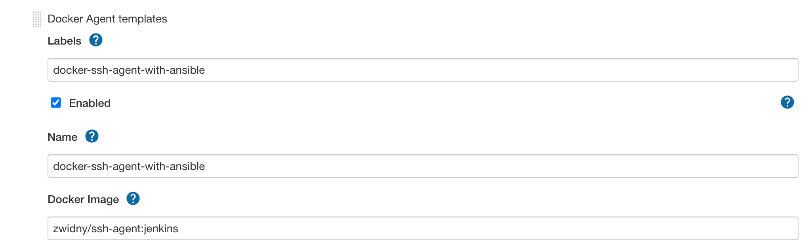

# Jenkins 篇 - 使用指定的agent with pipeline

本文主要介绍如何使用jenkins agent 另外此文基于[上篇](jenkins-agent.md)文章， 如果有任何疑问，请先阅读之

## 使用场景与问题

### 场景介绍

Jenkins 配置docker agent， 且配置了多docker agent template

### 问题

当使用pipeline时， 如何指定docker agent

## 解决方式

### 假设我们配置了如下Docker agent template

1. docker-ssh-agent
   
2. docker-ssh-agent-with-ansible
   

### 使用方式

假设我们想使用docker-ssh-agent-with-ansible, 我们只需在pipeline的agent里， 用label指出对应的agent即可

```groovy
pipeline {
    agent {
        label 'docker-ssh-agent-with-ansible'
    }
}
```